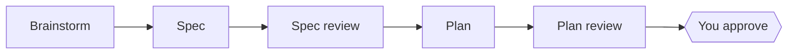
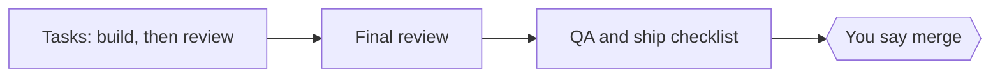
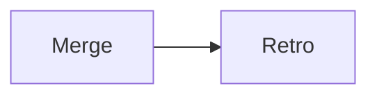

<div align="center">

# Agentic Delivery

**One plan to approve. A team of agents does the rest.**

A Claude Code plugin that takes a feature from an idea to a merged pull request.

[](LICENSE)


-lightgrey)

</div>

---

You approve one plan. Then agents build each task, review each diff, test what they built, and keep
a record of every commit and decision. At the end, they hand you a pull request that is ready to
merge, and a retro that says what the feature really cost.

The workflow comes from a real mobile project that ran it for weeks. Each rule exists because
something went wrong without it, and [`lessons.md`](lessons.md) tells the story behind each one.

> [!NOTE]
> The core is in place and has tests: the rules, the agents, the feature command, the project file,
> the scripts, and the hooks. The Flutter layer is written, and two runs on Flutter 3.38.9 stable
> measured its commands. The team pilot has not run yet, so version 0.1.1 is not tested on a real
> feature. See [Status](#status) and [Platforms](#platforms) before you install.

## Quick start

The plugin needs the superpowers plugin from the `claude-plugins-official` marketplace. The feature
command uses four of its skills. If one is missing, the command stops. The manifest names superpowers as a
dependency, so Claude Code can install it with this plugin. If it does not, install it first.

Add the repository as a marketplace, then install the plugin from it:

```bash
claude plugin marketplace add kkunan/agentic-delivery
```

```bash
claude plugin install agentic-delivery@agentic-delivery
```

To install from a local clone instead, give the path of the clone to the first command.
The option `--scope local`, `--scope project`, or `--scope user` on each command picks where Claude
Code stores the setting: your own local settings for this project, the settings file that the team
shares in the repository, or your settings for every project.

Run `claude plugin list` to check that `agentic-delivery` shows as enabled. Then copy the template
to `.claude/agentic-delivery.md` in your repository, as [Set up a project](#set-up-a-project) says,
and run `/feature` in Claude Code.

> [!IMPORTANT]
> An install test ran both commands with a local clone and `--scope local`. Each one gave exit 0,
> and `claude plugin list` showed the plugin as enabled. Nobody tested the GitHub form yet.

## How a feature runs

### 1. Shape the work



### 2. Build



### 3. Land



Two steps need you: the plan, and the merge. Everything between them runs on its own.

A small ticket can run in lite mode, which is experimental. A short brief replaces the spec and the
plan, and one session does the work, with one review at the end. The controller skill says when a
ticket qualifies.

## Why it works

| The problem | What the plugin does |
|---|---|
| Agents stop and ask about every small step. | You approve the plan once. Routine steps after that need no answer. |
| Nobody knows what a feature really cost. | A ledger records each commit, each decision, and the tokens of each phase. |
| A check passes because it cannot fail. | Each check states the value on a correct tree and on the defect, and the run measures both. |
| Sessions spend tokens on rules they do not need yet. | Rules are skills that load at the step that needs them. |
| Rules drift as each run edits them. | A retro only proposes changes, as a pull request that the team reviews. |

## How each role uses it

| You are | You do | You get |
|---|---|---|
| Engineer | Run `/feature`, approve the plan, say merge | A reviewed, tested pull request |
| Tech lead | Own the project file and the rule reviews | Real costs for the next estimate |
| Product owner | Set the acceptance rules, read the report | A one-minute report with screenshots |
| QA | Make sure that each check can fail | A QA log with a tally of every check |
| Designer | Give the visual source of truth | Design reviews and final screenshots |

<details>
<summary><b>Engineer</b></summary>

You run the pipeline for your own features.

1. Start a session at the root of the repository, and run `/feature` with the ticket or the idea.
2. Answer the brainstorm questions. The run writes the spec and the plan.
3. Read the plan and approve it. After that, the run works through the tasks without asking you.
4. When the pull request is ready, read the handoff, and say "merge" when you agree.

You can stop a run at any time. A status line that needs no answer is not a question for you.

</details>

<details>
<summary><b>Tech lead</b></summary>

You own how the team works with the plugin.

- Write the project file once for each repository: branches, devices, test accounts, the tracker
  steps, and the actions that need a person's word.
- Review the pull requests that retros propose against the rules. A rule changes only through that
  review.
- Read the cost lines in each ledger. They give real numbers for the next estimate.
- If the default agent does not know your stack, replace it with your team's own. Name it in the
  project file, and the run uses it for that seat.
- Optionally, name a delegate who approves plans that change nothing that a user sees.

</details>

<details>
<summary><b>Product owner</b></summary>

You decide what a feature must do and how it must look.

- Take part in the brainstorm, or give the engineer a ticket with clear acceptance rules.
- Each manual check in the plan states a value that can fail, so you can read the plan and know
  what "done" means.
- A plan that changes what a user sees comes to a person, even under a delegate.
- After the merge, read the feature report. It takes about one minute: screenshots of each screen,
  side by side with the screen before the change.

</details>

<details>
<summary><b>QA</b></summary>

You make sure that each check can fail.

- The QA reviewer agent reviews the spec and the plan for testability before any code exists.
- Manual checks go into the plan in a form that someone can disagree with, never "looks right".
- The run keeps a QA log that ends with a tally. The ready check refuses a branch with a check that
  did not run, unless a person waived it in writing.

</details>

<details>
<summary><b>Designer</b></summary>

You give the visual source of truth.

- A spec that changes a screen gets a design review and an accessibility review.
- The pull request links a screenshot of each changed screen, taken on the final branch.
- A visual change beside an approved design always comes to a person.

</details>

## Set up a project

Each project adds one file, `.claude/agentic-delivery.md`, which git tracks. It holds the facts of
that project, and the plugin never guesses these values. Its front matter names:

- the platform: `flutter` or `ios`
- the oldest plugin version that the project accepts
- the base branch, the release branch, the branch prefix for features, and the protected branches
- where the specs, plans, ledgers, and retros go: in the repository, or in a private folder that
  the run never commits, such as `~/agentic-notes/<project>`
- the file patterns of the screens, the names of the test processes, and the branch for screenshots
- the forge of the pull request, GitHub or GitLab, and the ticket tracker
- the push times of the feature branch: after each commit, or only at the start of the pull
  request and at ship
- the mutation runner for the platform
- optionally, your own agent for any of the three seats

Its body has sections for the tracker steps, the devices, the accounts, and the actions that need a
person's word, such as signing and secrets. The key `tracker` names the ticket tracker: Jira, Linear,
GitHub issues, GitLab issues, or none. The tracker steps are in plain words.

To start, copy `templates/agentic-delivery.md` from the plugin to `.claude/agentic-delivery.md` in
your repository. The template explains each key. The keys for the platform, the branches, the docs
folder, the screen patterns, the screenshot branch, and the tracker are empty, so fill them in. If
one is empty, `/feature` asks you for it before it starts. On GitLab, the screenshot branch may stay
empty, because the run can upload the images to the merge request. Fill in the sections for your
team. Write the place to find a sign-in, never the sign-in itself. Put a device id that belongs to
one person in local settings, not in the project file.

The plugin reads the front matter with `scripts/project-config.sh`. If the file is missing,
`/feature` stops and offers to copy the template.

## What is inside

```text
commands/feature.md      the pipeline, started with /feature
agents/                  implementer, reviewer, qa-reviewer
skills/run-rules/        the rules that every agent follows
skills/controller/       the rules for the session that runs the pipeline
skills/platform-*/       one platform layer in each folder: flutter, ios
templates/               the project file template
hooks/                   the start-up pointer and the retro reminder
output-styles/lean.md    the optional lean output style
lessons.md               the story behind each rule
docs/superpowers/specs/  the design of the plugin
docs/superpowers/plans/  the plan that builds it
scripts/                 ready check, stall watch, device claim, screenshot settle, mutation runner
tests/                   a test file for each script
```

### Skills, command, and agents

| Name | What it is | When it loads |
| --- | --- | --- |
| `/feature` (listed as `agentic-delivery:feature`) | The command that runs the pipeline | You run it |
| `agentic-delivery:controller` | The rules that only the controller follows: dispatch, review seats, estimates, stall watch, tracker steps, ship, merge, report, and retro | Step 0 of `/feature`, and again after a compaction |
| `agentic-delivery:run-rules` | The rules that every agent follows | Step 0 of `/feature`, and at the start of every dispatched task and review |
| `platform-flutter` | The Flutter layer, with the commands for build and test | For a project with `platform: flutter`, step 0 of `/feature` loads it after the two above. Its commands were measured on Flutter 3.38.9 stable |
| `platform-ios` | The iOS layer, SwiftUI first with UIKit notes | For a project with `platform: ios`, step 0 of `/feature` loads it after the two above. A CI job runs its commands on Xcode 16.4 |

The plugin also has three agents. The project file names the one for each seat, and the defaults
are these:

- `agentic-delivery:implementer` does one coding task from a brief.
- `agentic-delivery:reviewer` reviews the diff of one task, and the plan.
- `agentic-delivery:qa-reviewer` judges a spec or a plan for testability.

To use an agent of your team for a seat, set `implementer_agent`, `reviewer_agent`, or `qa_agent`
in the project file. A name that does not exist stops the run, with no fallback.

### Hooks

The plugin has two hooks. Each one adds a short text to the session:

- At the start of a session, a hook adds a pointer to `/feature`. It does so for a project that has
  the project file. It names the skills that the first step loads, and the folder of the plugin
  scripts.
- After a write to a retro file, a hook adds a reminder. The agent must not edit plugin files. It
  proposes each change as a pull request.

### Scripts and tests

The scripts are in `scripts/`. Each one has a test in `tests/`.

- `project-config.sh` reads one key from the front matter of the project file.
- `claim-device.sh` claims a device for one worktree, so that two runs never use the same one, and
  releases it.
- `stall-watch.sh` watches the worktrees, the test processes, and the command logs of a run, and
  reports a stall.
- `ready-check.sh` checks the pull request and the ledger. It says whether the pull request is ready.
  It works with a GitHub pull request through `gh` and with a GitLab merge request through `glab`.
- `settle-screenshot.swift` runs a capture command until the screen stops changing, then saves the
  last frame.
- `mutate.sh` applies each mutation from a manifest, runs the test that must catch it, records the
  verdict, and restores the file. A platform runner runs the tests. The Flutter runner is
  `skills/platform-flutter/mutation-runner.sh`, and the iOS runner is
  `skills/platform-ios/mutation-runner.sh`.

### Lean mode

The plugin ships an optional output style named `lean`, in `output-styles/lean.md`. It asks for
short replies: the answer first, no filler, one word for one meaning. Each developer turns it on for
themselves, through the output style setting of Claude Code. No step of the pipeline needs it.

Nobody measured a token saving for this mode, so the plugin makes no claim of one.

### Token cost

The figures come from `claude plugin details agentic-delivery`, run on plugin version 0.1.0 after a
local install. That run was before the platform skills existed, so the figures do not include them.
The tool says that its counts are estimates.

- Always on: about 250 tokens in every session, as measured before the platform skills existed.
  This is the name and description of each skill and agent.
- Paid on invoke, each time the item fires:

| Item | Always on | On invoke |
| --- | --- | --- |
| `run-rules` | about 40 | about 6.3k |
| `controller` | about 60 | about 8.6k |
| `reviewer` | about 40 | about 1.3k |
| `qa-reviewer` | about 50 | about 1.3k |
| `implementer` | about 40 | about 1.6k |
| `feature` | about 30 | about 1.7k |

Step 0 of `/feature` loads one platform skill, so each run pays its size on top of the table. By
`wc -c`, the `platform-flutter` skill is 31,303 characters long, and the `platform-ios` skill is
25,228 characters long. Nobody measured either one with `claude plugin details`. The name and
description of each one also add to the always-on figure.

The tool does not count hook output. The start-up hook adds its pointer to a session in a project
that has the project file. With `platform: flutter`, the pointer is 326 characters long, plus the
length of the path of the plugin folder. If the `platform` key is empty, the pointer only says
that the project file has no platform and that `/feature` asks for each empty key.

## Platforms

The core works with any project: the pipeline, the rules, the ledger, the reviews, and the retro do
not depend on a platform. A platform layer adds the commands to build, test, run devices, and take
screenshots. Without a layer, the agents have the rules but no platform commands.

| Platform | Targets | Status |
|---|---|---|
| Flutter | iOS, Android, web | Written. Two runs on Flutter 3.38.9 stable measured its commands. It has the mutation runner. |
| Native iOS | iOS, SwiftUI first, with UIKit notes | Rules written. It has the mutation runner. A CI job runs its commands and the runner against a sample app on Xcode 16.4. No real feature has used it yet. |
| Native Android | Android | Not started |
| Backend services | APIs and workers | Not started |
| Web front ends | Browsers | Not started |

A platform layer is one skill in `skills/platform-<name>/`. To add one, follow the shape of the
Flutter layer, and propose it as a pull request.

## Status

The Flutter layer is written, and two runs on Flutter 3.38.9 stable measured its commands. The iOS
layer comes from a native iOS project that ran more than 30 tickets through earlier versions of this
workflow and its scripts. A CI job runs the layer's commands and its mutation runner on Xcode 16.4
against a sample app, on each pull request. No project has run a feature through the plugin itself
yet. The rest of the plugin is in place and has tests.
The team pilot has not run yet, so version 0.1.1 is not tested on a real feature.

## Contributing

Propose a rule change as a pull request. Name the incident that it comes from, and add a lesson to
[`lessons.md`](lessons.md). Prose follows plain Simple English: short sentences, active voice, and
one word for one meaning.

Run the tests before you push:

```bash
bash tests/run-all.sh
```

The test of the Flutter runner uses the `flutter` that `FLUTTER_BIN` names, or else the one on the
`PATH`. Without either one, that test skips.

## License

[MIT](LICENSE)
