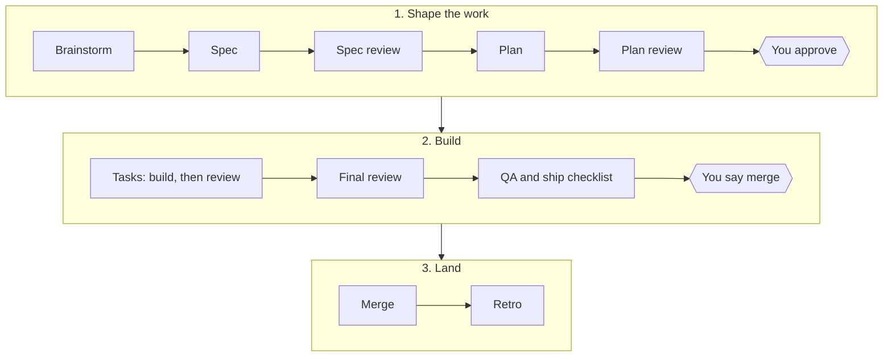

<div align="center">

# Agentic Delivery

**One plan to approve. A team of agents does the rest.**

A Claude Code plugin that takes a feature from an idea to a merged pull request.

[](LICENSE)


-lightgrey)

</div>

---

You approve one plan. Then agents build each task, review each diff, test what they built, and keep
a record of every commit and decision. At the end, they hand you a pull request that is ready to
merge, and a retro that says what the feature really cost.

The workflow comes from a real mobile project that ran it for weeks. Each rule exists because
something went wrong without it, and [`lessons.md`](lessons.md) tells the story behind each one.

> [!NOTE]
> The plugin is under construction. The rules, the agents, and the feature command are in place.
> The project file, the generic scripts, the hooks, and the Flutter layer are next. No platform layer
> is ready yet, so see [Platforms](#platforms) before you install. The plan is in
> [`docs/superpowers/plans/`](docs/superpowers/plans/).

## Quick start

```bash
claude plugin marketplace add kkunan/agentic-delivery
```

```bash
claude plugin install agentic-delivery@agentic-delivery
```

Then add `.claude/agentic-delivery.md` to your repository, and run `/feature` in Claude Code.

> [!IMPORTANT]
> The install commands come from the Claude Code help. Nobody tested them end to end yet.

## How a feature runs



Two steps need you: the plan, and the merge. Everything between them runs on its own.

## Why it works

| The problem | What the plugin does |
|---|---|
| Agents stop and ask about every small step. | You approve the plan once. Routine steps after that need no answer. |
| Nobody knows what a feature really cost. | A ledger records each commit, each decision, and the tokens of each phase. |
| A check passes because it cannot fail. | Each check states the value on a correct tree and on the defect, and the run measures both. |
| Sessions spend tokens on rules they do not need yet. | Rules are skills that load at the step that needs them. |
| Rules drift as each run edits them. | A retro only proposes changes, as a pull request that the team reviews. |

## How each role uses it

| You are | You do | You get |
|---|---|---|
| Engineer | Run `/feature`, approve the plan, say merge | A reviewed, tested pull request |
| Tech lead | Own the project file and the rule reviews | Real costs for the next estimate |
| Product owner | Set the acceptance rules, read the report | A one-minute report with screenshots |
| QA | Make sure that each check can fail | A QA log with a tally of every check |
| Designer | Give the visual source of truth | Design reviews and final screenshots |

<details>
<summary><b>Engineer</b></summary>

You run the pipeline for your own features.

1. Start a session at the root of the repository, and run `/feature` with the ticket or the idea.
2. Answer the brainstorm questions. The run writes the spec and the plan.
3. Read the plan and approve it. After that, the run works through the tasks without asking you.
4. When the pull request is ready, read the handoff, and say "merge" when you agree.

You can stop a run at any time. A status line that needs no answer is not a question for you.

</details>

<details>
<summary><b>Tech lead</b></summary>

You own how the team works with the plugin.

- Write the project file once for each repository: branches, devices, test accounts, the tracker
  steps, and the actions that need a person's word.
- Review the pull requests that retros propose against the rules. A rule changes only through that
  review.
- Read the cost lines in each ledger. They give real numbers for the next estimate.
- If the default agent does not know your stack, replace it with your team's own. Name it in the
  project file, and the run uses it for that seat.
- Optionally, name a delegate who approves plans that change nothing that a user sees.

</details>

<details>
<summary><b>Product owner</b></summary>

You decide what a feature must do and how it must look.

- Take part in the brainstorm, or give the engineer a ticket with clear acceptance rules.
- Each manual check in the plan states a value that can fail, so you can read the plan and know
  what "done" means.
- A plan that changes what a user sees comes to a person, even under a delegate.
- After the merge, read the feature report. It takes about one minute: screenshots of each screen,
  side by side with the screen before the change.

</details>

<details>
<summary><b>QA</b></summary>

You make sure that each check can fail.

- The QA reviewer agent reviews the spec and the plan for testability before any code exists.
- Manual checks go into the plan in a form that someone can disagree with, never "looks right".
- The run keeps a QA log that ends with a tally. The ready check refuses a branch with a check that
  did not run, unless a person waived it in writing.

</details>

<details>
<summary><b>Designer</b></summary>

You give the visual source of truth.

- A spec that changes a screen gets a design review and an accessibility review.
- The pull request links a screenshot of each changed screen, taken on the final branch.
- A visual change beside an approved design always comes to a person.

</details>

## Set up a project

Each project adds one file, `.claude/agentic-delivery.md`, which git tracks. It names:

- the platform, for example `flutter`
- the base branch and the branch prefix for features
- where specs, plans, ledgers, and retros go: in the repository, or in a private folder
- the test devices and the test account
- how to move a ticket in your tracker, in plain words, so that any tracker works
- the actions that need a person's word, such as signing and secrets
- optionally, your own agent for any of the three seats

A template for this file is coming with the project file task in the plan.

## What is inside

```text
commands/feature.md      the pipeline, started with /feature
agents/                  implementer, reviewer, qa-reviewer
skills/run-rules/        the rules that every agent follows
skills/controller/       the rules for the session that runs the pipeline
lessons.md               the story behind each rule
scripts/                 ready check, stall watch, device claim, screenshot settle, mutation runner
tests/                   a test file for each script
```

## Platforms

The core works with any project: the pipeline, the rules, the ledger, the reviews, and the retro do
not depend on a platform. A platform layer adds the commands to build, test, run devices, and take
screenshots. Without a layer, the agents have the rules but no platform commands.

| Platform | Targets | Status |
|---|---|---|
| Flutter | iOS, Android, web | In progress. The first layer. |
| Native iOS and Android | iOS, Android | Not started |
| Backend services | APIs and workers | Not started |
| Web front ends | Browsers | Not started |

A platform layer is one skill in `skills/platform-<name>/`. To add one, follow the shape of the
Flutter layer, and propose it as a pull request.

## Contributing

Propose a rule change as a pull request. Name the incident that it comes from, and add a lesson to
[`lessons.md`](lessons.md). Prose follows plain Simple English: short sentences, active voice, and
one word for one meaning.

Run the tests before you push:

```bash
bash tests/run-all.sh
```

## License

[MIT](LICENSE)
